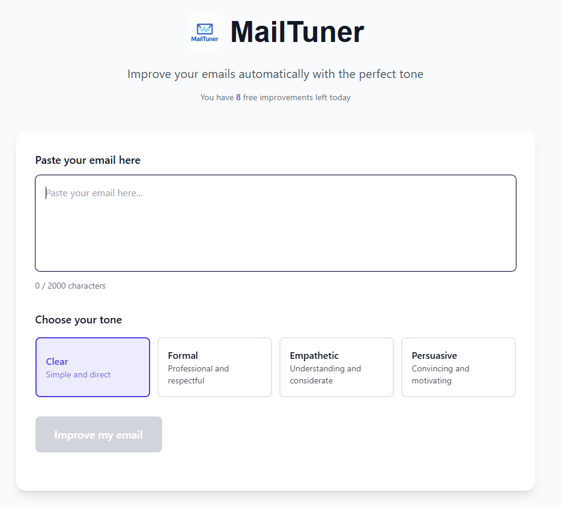
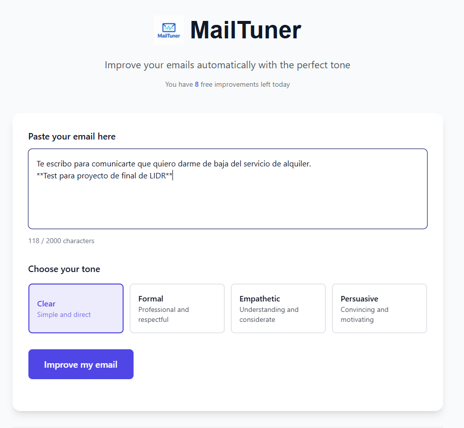
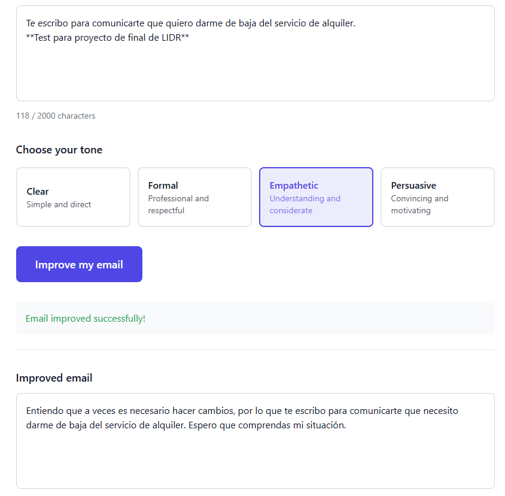
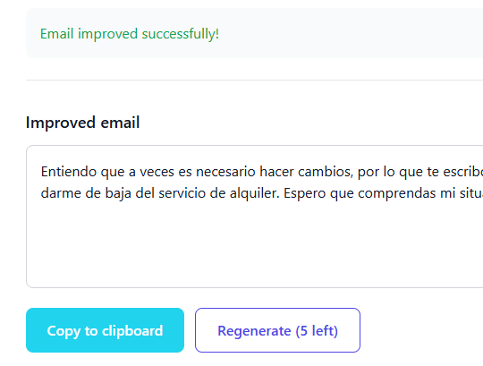

## Índice

0. [Ficha del proyecto](#0-ficha-del-proyecto)
1. [Descripción general del producto](#1-descripción-general-del-producto)
2. [Arquitectura del sistema](#2-arquitectura-del-sistema)
3. [Modelo de datos](#3-modelo-de-datos)
4. [Especificación de la API](#4-especificación-de-la-api)
5. [Historias de usuario](#5-historias-de-usuario)
6. [Tickets de trabajo](#6-tickets-de-trabajo)
7. [Pull requests](#7-pull-requests)

---

## 0. Ficha del proyecto

### **0.1. Tu nombre completo:**
Salvador Pérez Herrera
### **0.2. Nombre del proyecto:**
MailTuner
### **0.3. Descripción breve del proyecto:**
MailTuner es una herramienta basada en inteligencia artificial que permite reescribir correos electrónicos en un solo clic, ajustando su tono comunicativo (formal, claro, empático o persuasivo). Está diseñada para profesionales, freelancers y equipos que buscan mejorar su comunicación sin perder tiempo redactando versiones alternativas.  
### **0.4. URL del proyecto:**

[https://mailtuner.app](https://mailtuner.app)

### 0.5. URL o archivo comprimido del repositorio

[https://github.com/Salvadorph/mailtuner](https://github.com/Salvadorph/mailtuner)


---

## 1. Descripción general del producto

> Describe en detalle los siguientes aspectos del producto:

### **1.1. Objetivo:**

> Propósito del producto. Qué valor aporta, qué soluciona, y para quién.
El objetivo de MailTuner es facilitar la comunicación escrita profesional mediante la IA, ayudando a los usuarios a adaptar sus correos electrónicos al tono adecuado para cada contexto. El valor principal está en su rapidez, simplicidad y precisión en los resultados. Cualquier trabajador puede usarlo, público general.

### **1.2. Características y funcionalidades principales:**

> Enumera y describe las características y funcionalidades específicas que tiene el producto para satisfacer las necesidades identificadas.
- Reescritura instantánea de correos electrónicos según el tono elegido.  
- Interfaz limpia y minimalista construida con Next.js + TailwindCSS.  
- Control de uso mediante rate limiting por IP (Upstash Redis).  
- Métricas anónimas de uso (PostHog) y monitoreo de errores (Sentry).  
- Integración con Google Analytics 4 (ID: G-VXS86QZEKD).  
- Modelo freemium con posibilidad de ampliar créditos mediante suscripción. 

### **1.3. Diseño y experiencia de usuario:**

> Proporciona imágenes y/o videotutorial mostrando la experiencia del usuario desde que aterriza en la aplicación, pasando por todas las funcionalidades principales.
MailTuner presenta una interfaz centrada en la acción principal: **pegar un texto, elegir tono y reescribir**.  
El diseño prioriza la accesibilidad, con colores suaves, tipografía legible y animaciones sutiles.  
Se incluyen capturas de la pantalla principal y un breve recorrido por el flujo del usuario.

En todo momento tienes la información en la misma pantalla. El mas útil al iniciar el los mails que te quedan por realizar de manera gratuita en el dia:


Escribimos el mail que queremos:


En este caso seleccionamos el tono "Empathetic" y obtenemos el resultado una vez se pasa por la IA:


Obtenemos la opción de copiar o regenerar con el mismo tono u otro diferente:



### **1.4. Instrucciones de instalación:**
> Documenta de manera precisa las instrucciones para instalar y poner en marcha el proyecto en local (librerías, backend, frontend, servidor, base de datos, migraciones y semillas de datos, etc.)

```bash
# Clonar el repositorio
git clone git@github.com:Salvadorph/mailtuner.git
cd mailtuner

# Instalar dependencias
npm install

# Crear archivo de entorno
cp .env.local.example .env.local

# Ejecutar entorno local
npm run dev
```
PD: se requiere las keys, que no puedo subir en el proyecto.
---

## 2. Arquitectura del Sistema

### **2.1. Diagrama de arquitectura:**
> Usa el formato que consideres más adecuado para representar los componentes principales de la aplicación y las tecnologías utilizadas. Explica si sigue algún patrón predefinido, justifica por qué se ha elegido esta arquitectura, y destaca los beneficios principales que aportan al proyecto y justifican su uso, así como sacrificios o déficits que implica.

MailTuner sigue una arquitectura **serverless basada en funciones** (Next.js API Routes en Vercel).  
El flujo general: Frontend (Next.js) → /api/rewrite → OpenAI API → Respuesta IA → Interfaz Usuario
**Patrón:** arquitectura *Serverless + API Gateway*  
**Ventajas:** escalabilidad automática, menor mantenimiento, despliegue continuo.  
**Limitaciones:** tiempo de respuesta inicial (cold start) y límites por ejecución.

### **2.2. Descripción de componentes principales:**

> Describe los componentes más importantes, incluyendo la tecnología utilizada
- **Frontend:** React + Next.js, interfaz principal y comunicación con la API.  
- **API interna:** Endpoint `/api/rewrite` que procesa peticiones al modelo de OpenAI.  
- **Infraestructura:** Vercel (despliegue), Upstash Redis (rate limiting), PostHog (analítica) y Sentry (errores).  

### **2.3. Descripción de alto nivel del proyecto y estructura de ficheros**

> Representa la estructura del proyecto y explica brevemente el propósito de las carpetas principales, así como si obedece a algún patrón o arquitectura específica.

/mailtuner
├── /pages
│ ├── index.tsx # Página principal
│ └── /api/rewrite.ts # Endpoint IA
│
├── /components # Componentes UI reutilizables
│
├── /lib
│ └── rateLimit.ts # Middleware de control por IP
│
├── /docs
│ ├── mvp-requirements.md
│ ├── product-specs.md
│ └── technical-specs.md
│
├── .env.local.example
├── package.json
└── README.md

### **2.4. Infraestructura y despliegue**

> Detalla la infraestructura del proyecto, incluyendo un diagrama en el formato que creas conveniente, y explica el proceso de despliegue que se sigue

El proyecto se despliega automáticamente en **Vercel** al hacer push a la rama `main`.  
Vercel gestiona el entorno, SSL, variables de entorno y CI/CD.  

**Servicios externos:**
- Upstash Redis (REST)  
- PostHog  
- Sentry  
- Google Analytics 4  

### **2.5. Seguridad**

> Enumera y describe las prácticas de seguridad principales que se han implementado en el proyecto, añadiendo ejemplos si procede

- **Rate limiting por IP:** prevención de abuso de la API.  
- **Variables de entorno seguras:** sin exposición pública de claves.  
- **Forzado HTTPS:** todos los endpoints usan HTTPS.  
- **Sin almacenamiento sensible:** no se guardan textos de usuario.  

### **2.6. Tests**

> Describe brevemente algunos de los tests realizados
No se realizan test automáticos, todos ellos son manuales y en casos de uso reales.

---

## 3. Modelo de Datos

### **3.1. Diagrama del modelo de datos:**

> Recomendamos usar mermaid para el modelo de datos, y utilizar todos los parámetros que permite la sintaxis para dar el máximo detalle, por ejemplo las claves primarias y foráneas.

MailTuner carece de una base de datos en si, lleva el control de todo lo que necesita de manera *stateless* ayudandose en plataformas y herramiendas como Redis, con esta estructura básica:
REDIS {
        string ip
        int requests_count
        datetime last_request
    }


### **3.2. Descripción de entidades principales:**

> Recuerda incluir el máximo detalle de cada entidad, como el nombre y tipo de cada atributo, descripción breve si procede, claves primarias y foráneas, relaciones y tipo de relación, restricciones (unique, not null…), etc.
No hay relaciones ni claves foráneas

---

## 4. Especificación de la API

> Si tu backend se comunica a través de API, describe los endpoints principales (máximo 3) en formato OpenAPI. Opcionalmente puedes añadir un ejemplo de petición y de respuesta para mayor claridad

### **Endpoint principal:** `/api/rewrite`

**Método:** `POST`

**Body:**
{
  "text": "Texto original del correo",
  "tone": "formal | claro | empático | persuasivo"
}
**Response**
{
  "rewrittenText": "Versión ajustada al tono solicitado"
}

**Errores posibles:**
400 → Petición vacía o sin tono válido.
429 → Límite de uso superado (rate limit).
500 → Error interno en la llamada a OpenAI.

---

## 5. Historias de Usuario

> Documenta 3 de las historias de usuario principales utilizadas durante el desarrollo, teniendo en cuenta las buenas prácticas de producto al respecto.

**Historia de Usuario 1:**  
Como usuario, quiero pegar un correo y elegir un tono para obtener una versión mejorada del texto.  

**Historia de Usuario 2:**  
Como usuario gratuito, quiero saber cuántos usos me quedan para decidir si me suscribo.  

---

## 6. Tickets de Trabajo

> Documenta 3 de los tickets de trabajo principales del desarrollo, uno de backend, uno de frontend, y uno de bases de datos. Da todo el detalle requerido para desarrollar la tarea de inicio a fin teniendo en cuenta las buenas prácticas al respecto. 

**Ticket 1 (Backend):**  
Implementar endpoint `/api/rewrite` y conexión con OpenAI, validando parámetros y controlando errores.  

**Ticket 2 (Frontend):**  
Crear la interfaz inicial con selector de tono y campo de texto conectado a la API.  

**Ticket 3 (Infraestructura):**  
Configurar middleware de rate limiting con Upstash Redis y despliegue automático en Vercel. 

---

## 7. Pull Requests

> Documenta 3 de las Pull Requests realizadas durante la ejecución del proyecto

**Pull Request 1**
Todo el pull request que hice fue el único.


## Aclaració alumno Salvador
Como aclaración este proyecto lo realicé en julio, cuando sabía que había un proyecto final y ya se habían dado las clases de meta-prompting, buenas prácticas de promting y generación de .md para las diferentes partes del proyecto que adjunto en la carpeta *DOC*.

Igualmente, llevo desarrollando muchos años y ya contaba con bastante experiencia previa. 
Si en el proyecto véis commits del usuario AuremaPG, es del usuario de git mio que tengo para proyectos personales de emprendimiento: AuremaPG - FriendsTech

